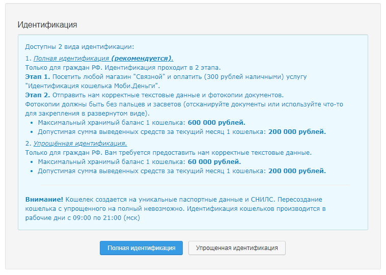

# Добавление кошелька UnitWallet


**Внимание!** Каждый кошелек \(полный или упрощенный\) создается на уникальные паспортные данные и СНИЛС \(**1 человек = 1 кошелёк**\). Пересоздание кошелька с упрощенного на полный невозможно.

Регистрация кошельков возможна только для **совершеннолетних граждан РФ.**


Для начала работы с Unitpay вам необходимо зарегистрировать первый кошелек UnitWallet **с полной идентификацией** на основного выгодоприобретателя вашего бизнеса \(предварительно рекомендуем вам [ознакомиться с FAQ](https://help.unitpay.money/unitpay-management/dobavlenie-koshelka-unitwallet#faq)\):

1\) Перейти в личном кабинете в настройки аккаунта 

2\) Прокрутить вниз до формы добавления кошельков:

3\) Зарегистрируйте первый кошелек с полной идентификацией. После заполнения полей и загрузки сканов документов наша служба поддержки проведет модерацию и направит данные на создание кошельков. Модерация кошельков производится в рабочие дни **с 09:00 по 21:00 \(мск\).**

6\) После успешного создания кошельков вы получите уведомление от нашей службы поддержки.

7\) Дополнительные кошельки \(полные и упрощенные\) вы сможете добавить только после успешной регистрации основного кошелька.

## FAQ

**В: Есть ли разница, каким способом зарегистрировать кошелек?**   
О: Да. На каждом зарегистрированном через “Связной” кошельке, вы можете хранить до 600 тыс. рублей. На кошельках, зарегистрированных через виджет – не более 60 тыс. рублей. Прием и выплату средств на сумму от 50 \(15\) тыс. рублей также возможно производить только через кошельки, зарегистрированные через “Связной”. Поэтому советуем завести хотя бы несколько кошельков именно через “Связной”.  
  
**В: На кого я могу регистрировать кошельки?**  
О: Регистрация доступна только для граждан РФ. Всех, на кого вы зарегистрируете такие кошельки, мы считаем выгодоприобретателями вашего бизнеса.

**В: А как я буду управлять потоками через эти кошельки?**  
О: Мы берём эту функцию на себя. Вам не нужно будет тратить на это время.

**В: Лица, на которые будут зарегистрированы кошельки, должны иметь отношение к нашему бизнесу?**  
О: Для нас владельцы всех кошельков, которые привязаны к аккаунту, будут считаться выгодоприобретателями вашего бизнеса.

**В: Как проверяются данные для заведения кошельков?**  
О: Соответствие данных действительности проверяется по различным базам на стороне НКО.   
  
**В: В каком случае кошельки могут быть заблокированы и что будет с деньгами, хранящимися на них?**   
О: Кошельки блокируются, если паспорт по результатам автоматической проверки на стороне НКО будет признан недействительным \(истек срок действия, гражданин сменил фамилию и т.д.\).  
  
**В: Чем отличаются кошельки с упрощенной идентификацией \(через виджет\) от кошельков с полной идентификацией \(через салоны связи “Связной”\)?**  
О: Если вы регистрируете кошелек через виджет, вы регистрируете упрощённый кошелек. Допустимая сумма выведенных средств за текущий месяц - 200 тыс. руб. / месяц, максимальный баланс - 60 тыс. рублей. Когда все кошельки “забиты” средствами, вы не сможете принять большой платеж, нужно выводить оттуда средства. Сумма одной транзакции на вывод с таких кошельков также ограничена: 15 тыс. рублей. Поэтому рекомендуем, по возможности, заводить кошельки с полной идентификацией. Как минимум, какой-то процент кошельков с полной идентификацией \(через "Связной"\) следует завести. Допустимая сумма вывода через них такая же - 500 тыс. руб. / месяц, но максимальный баланс там - до 600 тыс. рублей. Можно принимать \(до 500 тыс. рублей\) и выводить большие суммы \(до 100 тыс. рублей\).  
  
**В: А как быть тем, кто из Украины?**   
О: Понимаем, что это довольно непростая задача для вас, но вам необходимо зарегистрировать кошелёк на выгодоприобретателя - гражданина РФ.  
  
**В: Мы зарегистрировались на упрощенный кошелек, но потом хотим сделать полный через Связной. Там можно сделать?**   
О: Кошелек создается на уникальные паспортные данные и СНИЛС. Пересоздание кошелька с упрощенного на полный невозможно.

**В: Если я зарегистрирую кошелёк на доверенное лицо, оно сможет получить доступ к моему аккаунту или средствам?**   
О: Нет, не сможет.

**В: И если у меня 2 аккаунта unitpay, можно ли будет это лицо зарегистрировать на оба аккаунта?**   
О: Нет, 1 аккаунт - 1 кошелёк.

**В: Если нет Связного, можно ли зарегистрировать полный другим способом?**   
О: Регистрация кошельков с полной идентификацией доступна только через магазины "Связной". Регистрация упрощённых кошельков доступна без личного визита и производится онлайн.

**В: Для самозанятых тоже нужны кошельки?**   
О: Да

**В: Почему моя заявка на кошелек отклонена?**  
О: К сожалению, НКО МобиДеньги отклонила заявку на создание кошелька. Причины отклонения нам неизвестны, но на данные этого гражданина кошелек зарегистрировать не получится. Попробуйте зарегистрировать кошелек на данные другого выгодоприобретателя.

