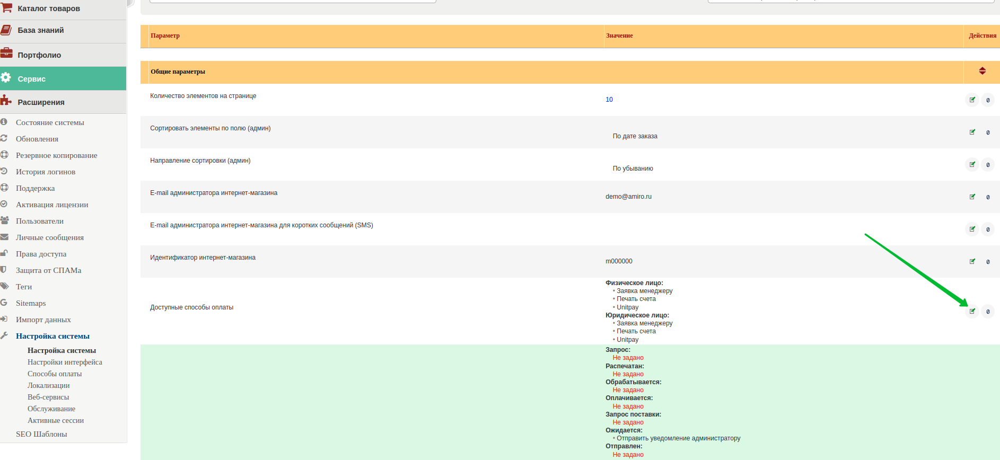

# Amiro CMS

### Инструкция по настройке и установке модуля. 

1. Скачайте [архив](https://github.com/unitpay/amiro-module/archive/master.zip) с модулем.

2. Перейдите по ссылке [**http://ваш\_сайт/\_admin/engine.php?mod\_id=ami\_market&upload=1**](http://xn--_-7sbbf2b7bj7b/_admin/engine.php?mod_id=ami_market&upload=1)​

3. Выберите в качестве файла дистрибутива скачанный архив с модулем и загрузите его.

4. Перейдите в "Сервис"-&gt; "Настройка системы"-&gt; "Способы оплаты".

5. Найдите в списке драйверов Unitpay и нажмите "Установить".

6. Нажмите кнопку "Редактировать" в строке Unitpay и заполните поля DOMAIN \(unitpay.money\), PUBLIC KEY и SECRET KEY, которые вы можете взять в личном кабинете unitpay.money. Далее нажмите на кнопку сохранить.

7. Переходим в Сервис-&gt;Настройка системы и в выпадающем списке выбираем "Каталог товаров"-&gt; "Заказы".

8. В строке "Доступные способы оплаты" нажимаем "Редактировать".

10. Выбираем необходимые способы, включая Unitpay и в самом низу жмем кнопку "Применить изменения".

11. В личном кабинете Unitpay.ru введите адрес обработчика платежей [http://&lt;адрес](http://xn--/%3C-8cdug0fj/) вашего сайта&gt;/drivers/gate\_unitpay.php. Из-за особенностей модуля будет гореть красным "Ошибка формата", это нормально.

