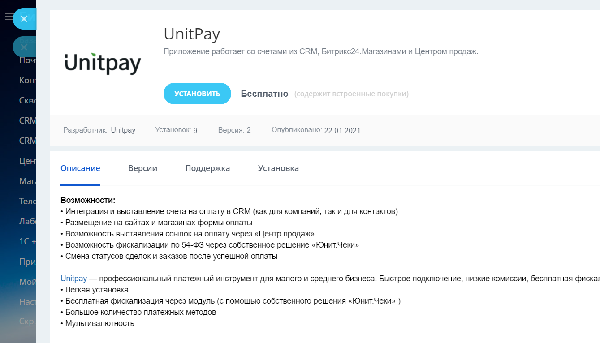
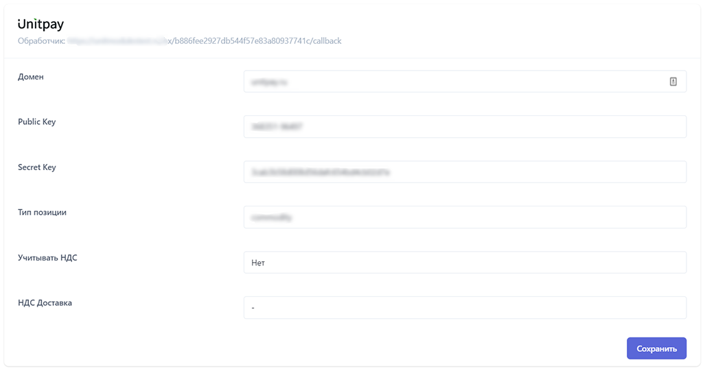
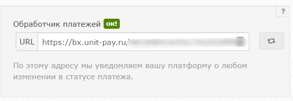
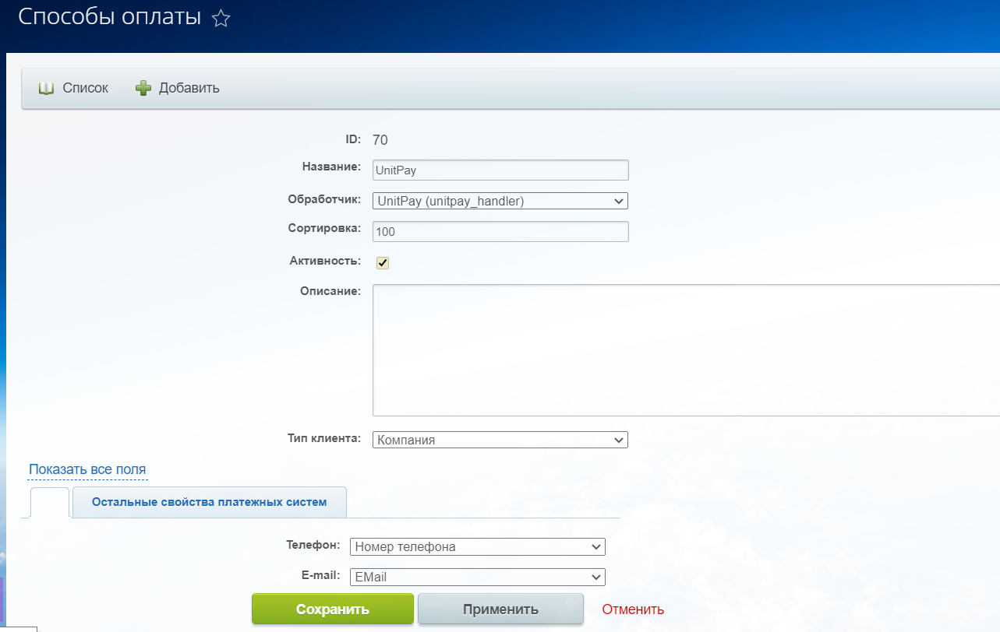
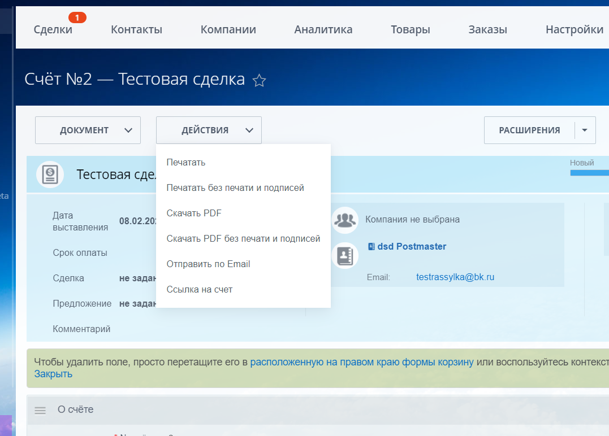
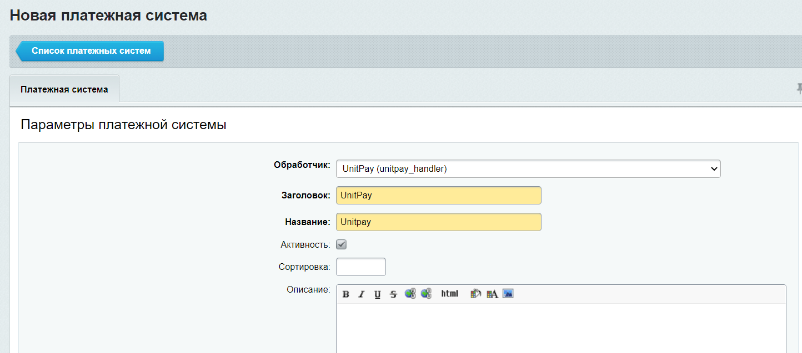

# Bitrix24

### Инструкция по настройке и установке модуля.


Ссылка на маркетплейс [https://www.bitrix24.ru/apps/?app=unitpay.unitpay](https://www.bitrix24.ru/apps/?app=unitpay.unitpay)


**Возможности:** 

* Интеграция и выставление счета на оплату в CRM \(как для компаний, так и для контактов\)
* Размещение на сайтах и магазинах формы оплаты 
* Возможность выставления ссылок на оплату через «Центр продаж» 
* Возможность фискализации по 54-ФЗ через собственное решение «Юнит.Чеки» 
* Смена статусов сделок и заказов после успешной оплаты

**Установка:**

1.Установите приложение Unitpay \(раздел "Приложения" -&gt; в поиске наберите Unitpay -&gt; Установить\)

2. Добавьте: домен \(unitpay.money\), Public Key, Secret Key \(их можно взять в настройках проекта в личном кабинете Unitpay\).

3. Скопируйте и добавьте обработчик в настройки вашего проекта в личном кабинете Unitpay.

4. Для добавления платежной системы в **CRM** перейдите CRM ****-&gt; Настройки -&gt; Способы оплаты -&gt; Создать платежную систему

5. Установите название \(например, Unitpay\). Задайте обработчик из списка UnitPay \(unitpay\_handler\). Проверьте, чтобы стоял флаг активности. Задайте тип клиента - контакт или компания, в зависимости от того с кем будете работать. Можно добавить 2 модуля Unitpay и для каждого выбрать свой тип.

6. Для выставления счета в CRM перейдите в Сделку -&gt; Счета -&gt; Выставить счет -&gt; Действия -&gt; Выставить счет

Счет может быть выставлен в ссылке/email/sms или другим способом \(если вы подключите «Центр продаж»\).

7. Для добавления платежной системы в **Магазин** перейдите Магазин -&gt; Еще -&gt; Настройки -&gt; Платежные системы -&gt; Добавить платежную систему 

