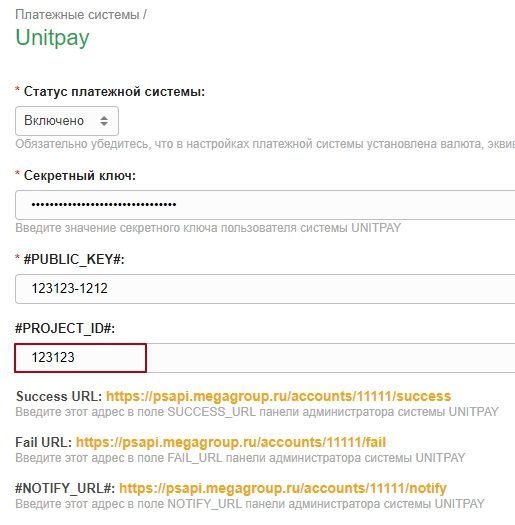
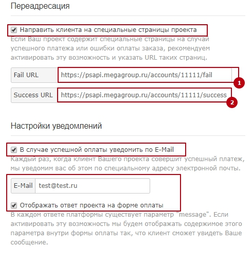
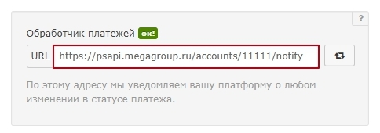
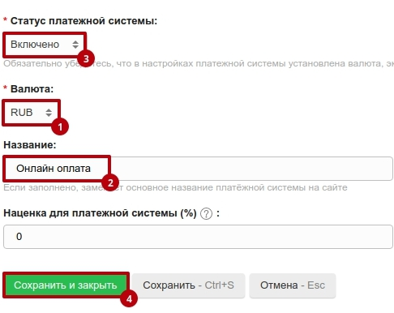

# CMS-S3

### Инструкция по настройке и установке модуля.


Подробная [инструкция на сайте Megagroup](https://help.megagroup.ru/unitpay#)


1\)Перейдите в CMS-S3 в панель управления, в разделе "Платежные системы" выберите Unitpay.

**PROJECT\_ID** - id вашего проекта в личном кабинете Unitpay.   
**PUBLIC KEY** - вы можете узнать в личном кабинете Unitpay.   
**SECRET KEY** - вы можете узнать в личном кабинете Unitpay.   
  
**Success URL** - адрес, который используется на странице настроек Unitpay в поле Success URL. Скопируйте и вставьте его.   
**Fail URL** - адрес, который используется на странице настроек Unitpay в поле Fail URL. Скопируйте и вставьте его. 

**Notify\_URL** - адрес, который используется на странице настроек Unitpay в поле "Обработчик платежей". Скопируйте и вставьте его.

Не забудьте выбрать валюту, указать наименование и активировать модуль.

