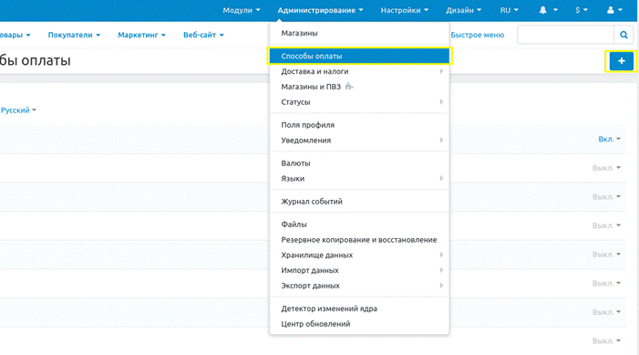
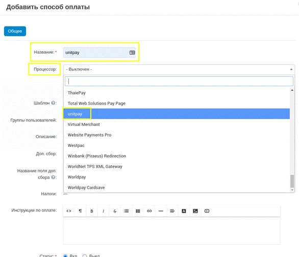

# CS-Cart

### Инструкция по настройке и установке модуля. 

1. Скачайте [архив](https://github.com/unitpay/cscart-module/releases/tag/3.0.0) с модулем.

2. Скопируйте содержимое папки “**unitpay-addon**” из архива в корень вашего сайта.

3. Зайдите в административную панель в раздел “**Модули → Управление модулями**”, найдите модуль “**unitpay**” и установите его нажав на кнопку “**Установить**”. Дождитесь установки.

4. Зайдите в “**Администрирование → Способы оплаты**” и нажмите на кнопку “**+**”.

5. В первое поле “Название” введите произвольное название на ваш выбор. Во втором поле “**Процессор**” найдите и выберите “**unitpay**”.

6. Появится дополнительная вкладка “**Настроить**”. Вбейте в соответствующие поля данные от вашего проекта в Unitpay. 

7. После этого нажмите кнопку "**Создать**".

9. В личном кабинете unitpay введите путь к обработчику платежей по шаблону:    
[ https://ваш.сайт/unitpay\_callback](%20https://ваш.сайт/unitpay_callback)

