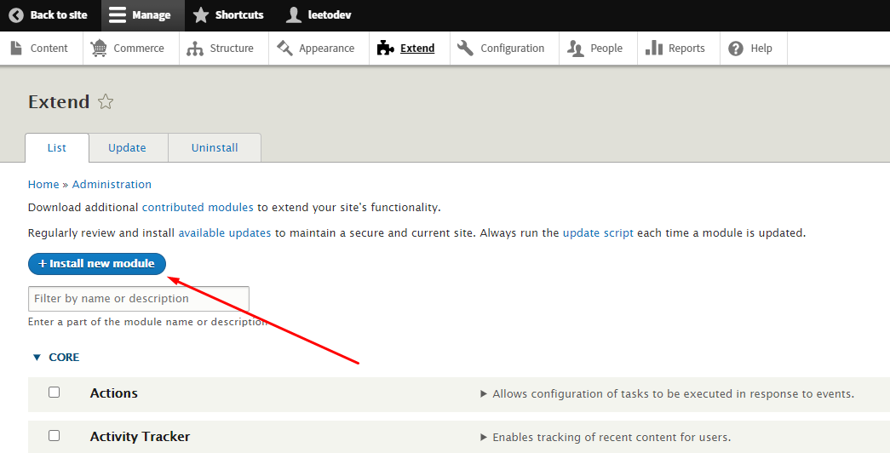
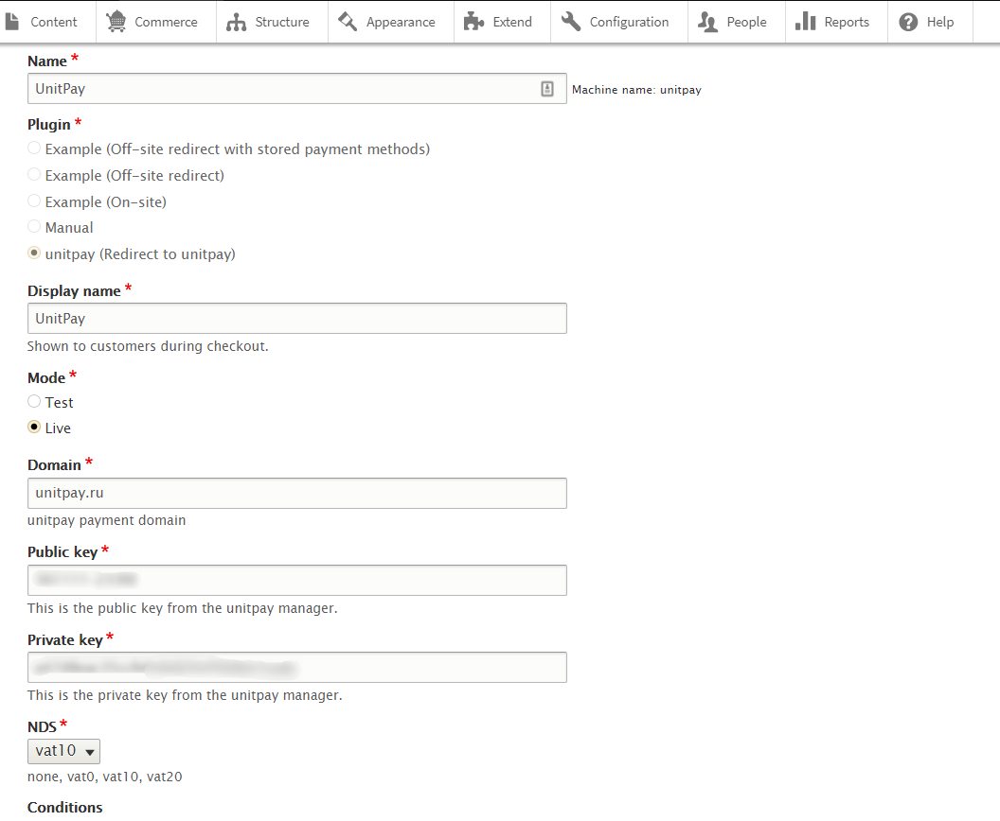
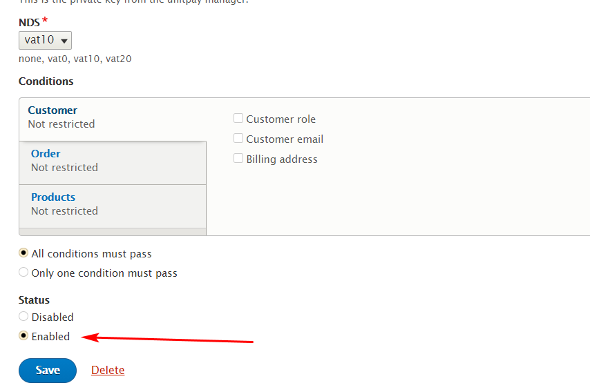
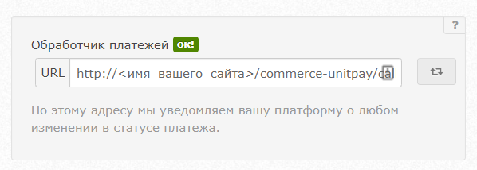
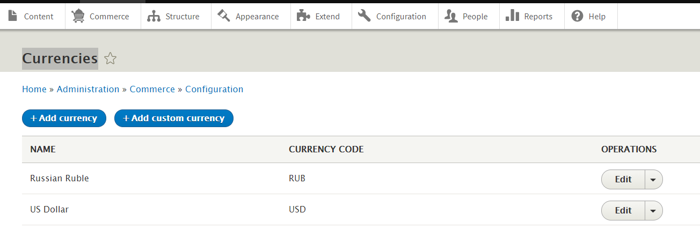
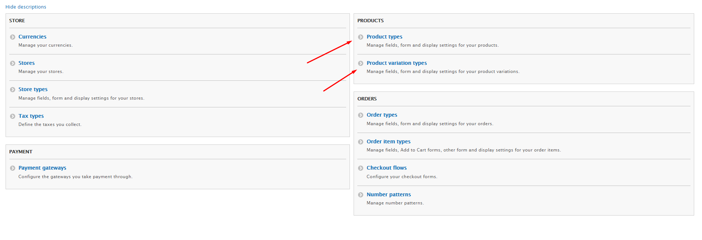
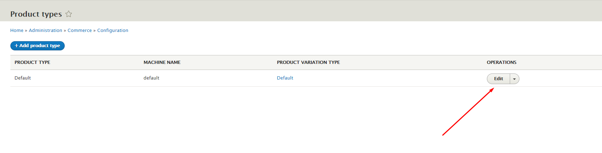
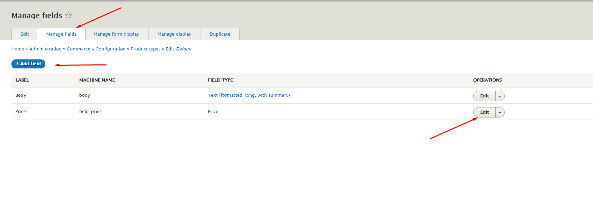
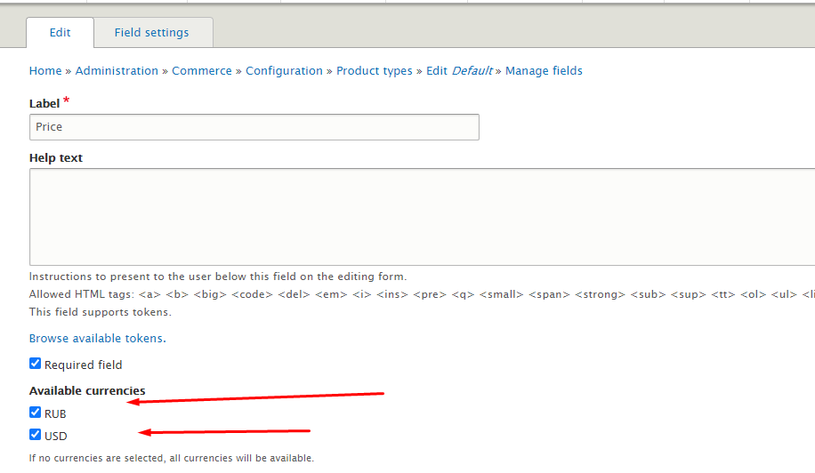

# Drupal 8, 9 \(commerce\)

**Instructions for configuring and installing the module.**


The module supports working with version 8 and 9 of Drupal \(commerce\)


1. Download the [archive with the module](https://github.com/unitpay/drupal/archive/main.zip).

2. install the module. to do this, go to extend - &gt; install new module. Select the archive with the module and then "Save".

3. Go To commerce - &gt; Configuration -&gt; Payment gateway. PAYMENT GATEWAY: "Unitpay" click "edit".In the DOMAIN field, INSERT the value unitpay.money, in the PUBLIC KEY  and SECRET KEY , copy the public and secret key from the unitpay personal account.

4. Enable the module and save it.

5. in your unitpay dashboard, add the address of the handler in the format http://&lt;name of your site&gt;/commerce-unitpay/callback

6. the currency is set in two places. Commerce -&gt; Configuration -&gt; Currencies

7. and then, to be able to change in products, you need to add to "Product types". Commerce -&gt; Configuration -&gt; Product types -&gt; Edit Default -&gt; Manage fields

8. Similarly, you need to do for "variation types". Commerce -&gt; Configuration -&gt; Product variation types -&gt; Edit Default -&gt; Manage fields

