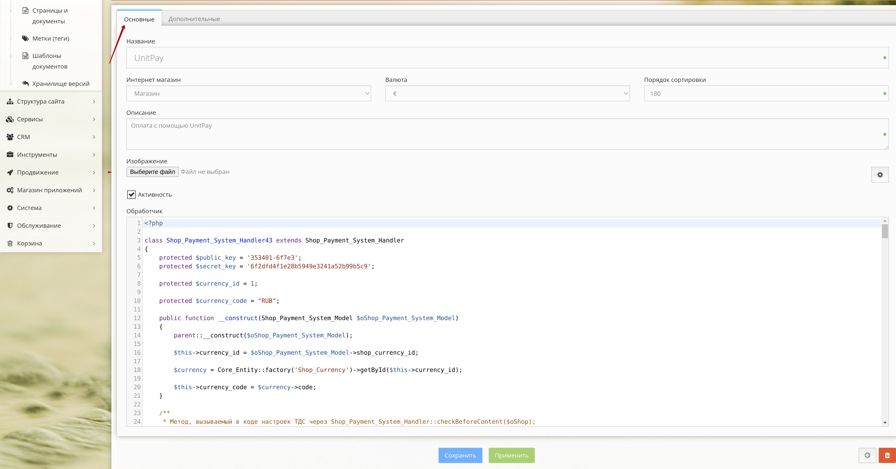
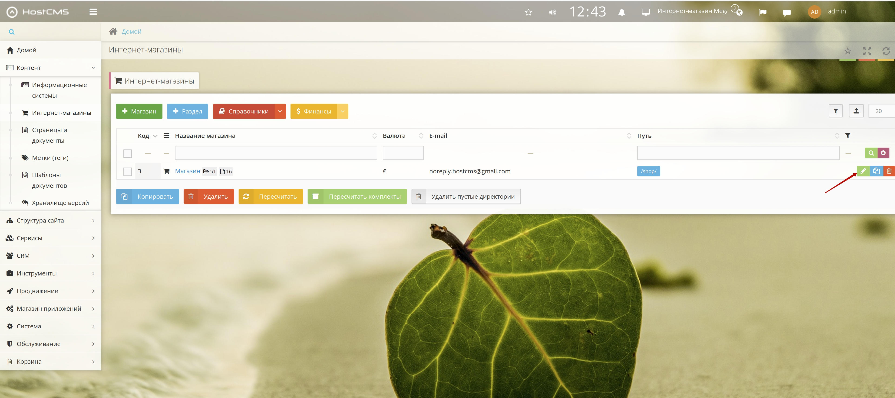
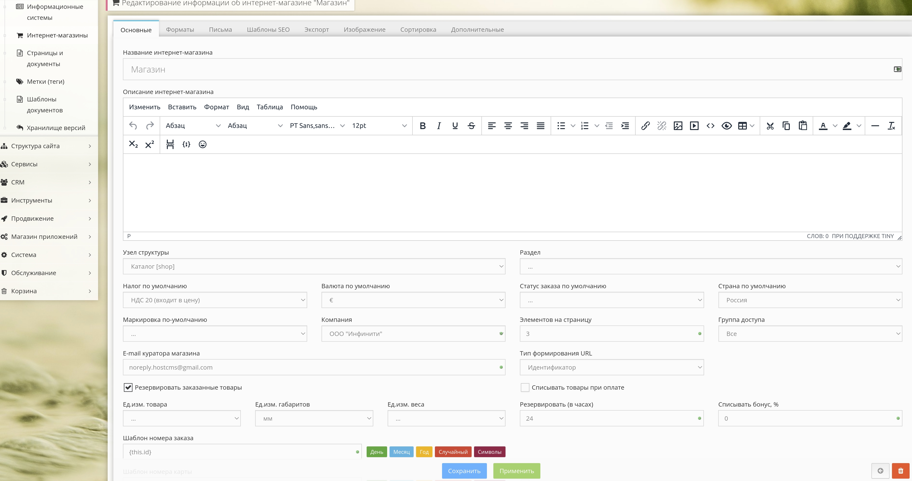

# HostCMS

1.Скачайте [модуль](https://github.com/unitpay/hostcms-module/archive/master.zip)

2. Перейдите в административную панель вашего сайта

3. Перейдите в Контент-&gt;Интернет-магазины, выберите ваш магазин и затем перейдите в справочники-&gt;платежные системы.

4.Добавьте новую платежную систему, в названии напишите Unitpay, в описание допустим "платежная система Unitpay" и нажмите применить.

5. Нажмите кнопку редактировать напротив платежной системы Unitpay, далее перейдите на вкладку "дополнительные" и запомните число в поле "Идентификатор"

6. Далее перейдите на вкладку "основные" и в поле "обработчик" скопируйте содержимое файла модуля handlerXX.php

7. В названии класса Shop\_Payment\_System\_HandlerXX вместо XX введите запомненный ранее идентификатор.

8. В обработчике же введите значения переменных $domain = 'unitpay.money', $public\_key и $secret\_key которые вы можете взять в личном кабинете unitpay.money

9. По необходимости значению переменной $currency\_name нужно присвоить код валюты\(которая присутствует в магазине\), в которой вы хотите принимать платежи, по умолчанию стоит RUB

10. В личном кабинете Unitpay.money введите адрес обработчика платежей [http://&lt;адрес](http://xn--%3C-8cdug0fj/) вашего сайта&gt;/shop/cart/

12. Для того чтобы изменить валюту во всем магазине перейдите в Контент -&gt; Интернет-магазины, нажмите редактировать.

