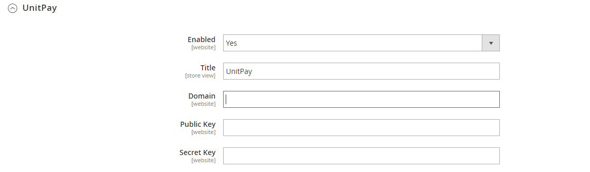

# Magento 2

### Инструкция по настройке и установке модуля. 

1.Скачать [архив модуля](https://github.com/unitpay/magento2/archive/main.zip) и загрузить в корень сайта.  

2. В консоли из корня сайта запустить команду php bin/magento setup:upgrade для установки модуля  

3. php bin/magento setup:di:compile для компиляции конфигурационных файлов  

4. Заходим в админ панель. Stores -&gt; Configuration

5. В левом меню выбираем Sales -&gt; Payment Methods

6. Находим модуль unitpay и задаем настройки Domain \(**unitpay.money**\), Public Key, Secret Key \(можно взять в настройках проекта в личном кабинете Unitpay\)

7. По умолчанию доставка действует на каждый товар \(3 товара = тройная стоимость доставки\). Чтобы это настроить идём в Stores -&gt; Configuration . Потом в раскрывающимся списке Sales ищем Shipping methods

