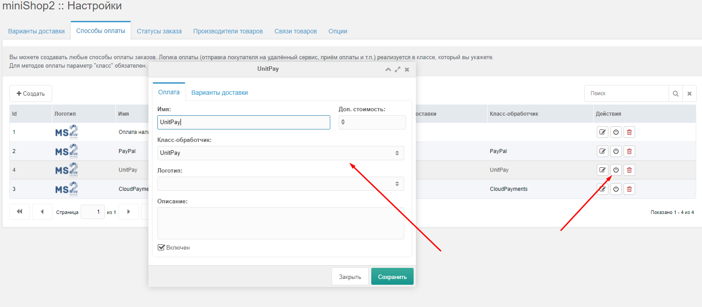
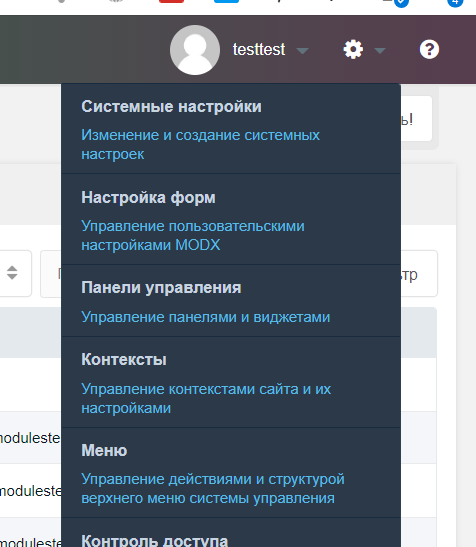
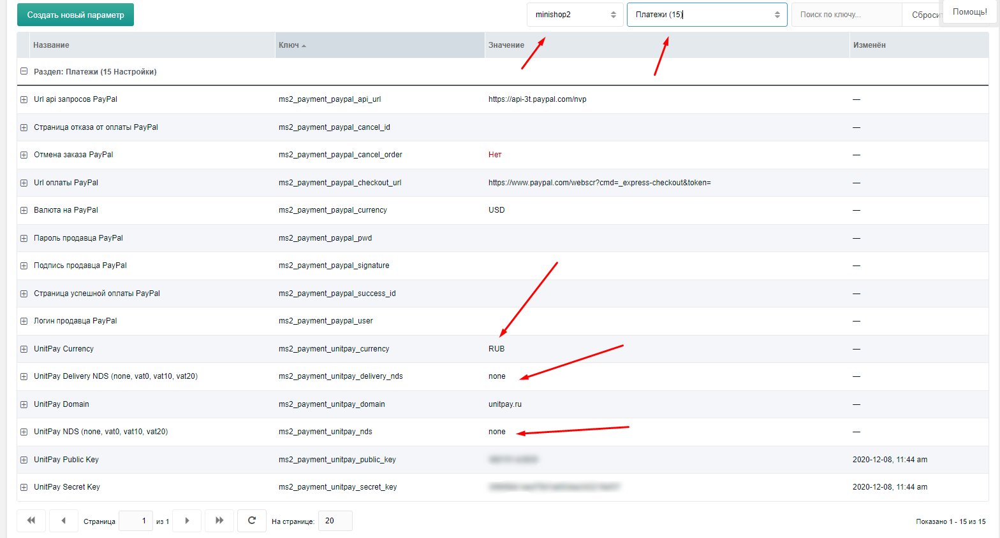
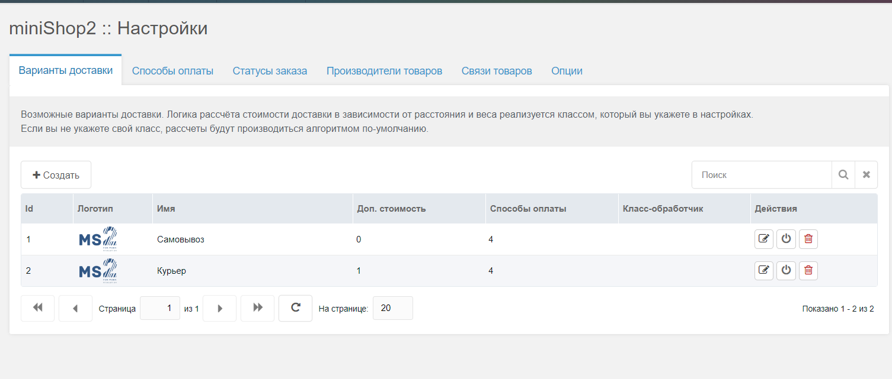
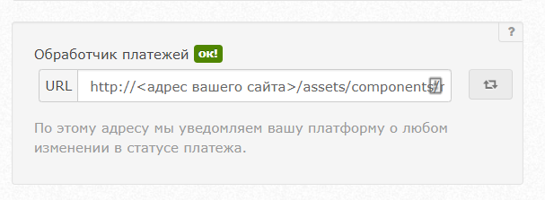

# MODX \(miniShop2\)

**Instructions for configuring and installing the module.**

1. Download the [archive with the module](https://github.com/unitpay/modx/archive/main.zip).

2. Copy the contents of the unitpay directory from the archive to the root of your site.

3. Run your script YOUR\_DOMAIN/unitpay\_setup.php

4. Go to Packages - &gt; Minishop 2 - &gt; Settings -&gt; payment Methods. Make sure that the UnitPay module is present in the list and enabled. if not, add

5. Go to "System Settings & Events" in the MODX Control Panel. 

Filter by the type of settings - "minisho2" and the type of "Payments". Install UnitPay Domain \(**unitpay.money**\), UnitPay Public Key, UnitPay Secret Key \(you can get them in the project settings in the Unitpay personal account\)

The VAT settings \(none, vat0, vat10, vat20\) and currency are also set here.

6. Delivery is set in packages -&gt; minishop2 -&gt; settings delivery options

7. In your Unitpay dashboard, enter the address of the payment processor http://&lt;your website&gt;//assets/components/minishop2/payment/unitpay.php

