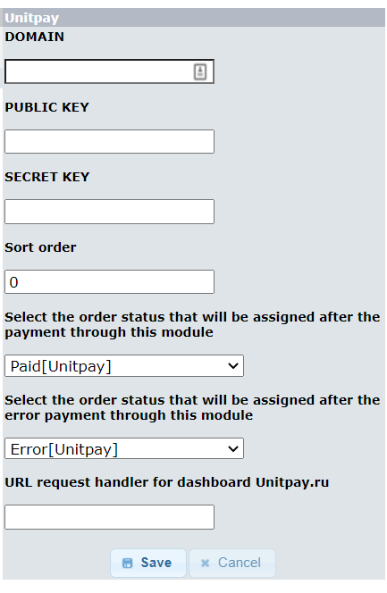

# osCommerce

### Инструкция по настройке и установке модуля. 

1. Скачайте [архив](https://github.com/unitpay/oscommerce-module/archive/master.zip) с модулем.

2. Скопируйте содержимое директории unitpay из архива в корень вашего сайта.

3. Перейдите в "Modules-&gt;Payment".

4. Выберите "Unitpay" и нажмите "Install Module".

6.Нажмите кнопку "Edit" для "unitpay".

7. Введите домен \(DOMAIN\) - unitpay.money, публичный ключ \(PUBLIC KEY\) и секретный ключ \(SECRET KEY\), их вы можете взять из личного кабинета unitpay.ru.

8. Если необходимо, также введите порядок сортировки \(в каком порядке будут выводиться платежные системы на странице выбора платежных систем\), статус заказа, на который будет сменяться статус при удачной оплате \(по умолчанию это "Paid\[Unitpay\]" и статус заказа, на который будет меняться статус при ошибке оплаты \(по умолчанию это Error\[Unitpay\]\).

9. Нажмите на кнопку "Save".

10. В личном кабинете Unitpay.ru введите адрес обработчика платежей [http://&lt;адрес](http://xn--/%3C-8cdug0fj/) вашего сайта&gt;/unitpay.php

