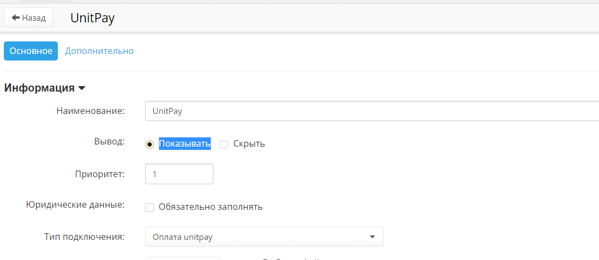

# PHPShop

### Инструкция по настройке и установке модуля. <a id="instrukciya-po-nastroike-i-ustanovke-modulya"></a>

1. Скачайте [архив](https://github.com/unitpay/phpshop-module/archive/master.zip) с модулем.

2. Распакуйте содержимое архива в корень сайта.

3. В файле phpshop/inc/config.php добавьте следующие строчки:

```text
[unitpay]​domain = "unitpay.money";​ public_key = "<Ваш публичный ключ из личного кабинета unitpay>";​secret_key = "<Ваш секретный ключ из личного кабинета unitpay>";
```

4. В админпанели перейти в "Заказы"-&gt; "Способы оплаты" и добавить способ оплаты "Unitpay". Проверьте, чтобы стояла галка "Показывать".



5. В личном кабинете unitpay.money введите адрес обработчика платежей [http://](http:)​[&lt;адрес](http://xn--/%3C-8cdug0fj/) вашего сайта&gt;/payment/unitpay/result.php


