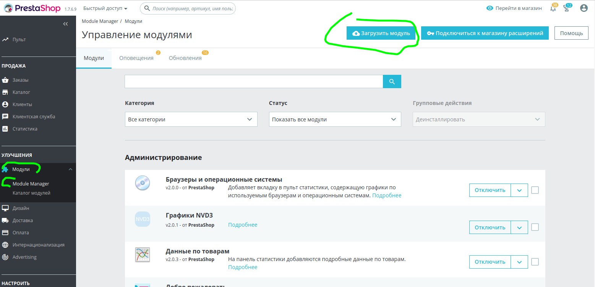
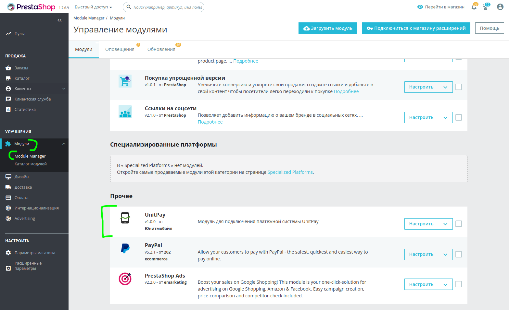

# Prestashop

#### Инструкция по настройке и установке модуля.


Модуль поддерживается в версиях Prestashop 1.6 и 1.7


1. Скачайте  [архив](https://github.com/unitpay/prestashop-module/archive/master.zip) с модулем \(.zip\). Переименуйте папку "prestashop-module-master" в "unitpay"

2. Откройте панель управления сайтом. 

3. Нажмите кнопку «Модули» в левом меню панели управления, затем кнопку «Добавить модуль» в правом верхнем углу. Выберите скачанный файл модуля и нажмите «Загрузить этот модуль».

4. После успешной загрузки наберите в строке быстрого поиска слово unitpay, и вы найдете установленный модуль \(в версии 1.7 модуль будет находиться внизу страницы\).

5. Нажмите на зеленую кнопку «Установить», которая находится справа от модуля.

6. После успешной установки вы попадете на страницу настроек модуля. Здесь вам нужно ввести домен \(unitpay.money\), secret key и public key, которые нужно взять на странице проекта в личном кабинете учетной записи unitpay. После ввода нажмите кнопку «Сохранить».

7. Для корректной работы модуля необходимо, чтобы были включены ЧПУ. Для этого перейдите в Настройки-&gt; SEO-&gt; URLs и включите ЧПУ.

8. Также рекомендуем добавить округление стоимости товаров. Перейдите в "Настройки" -&gt; "Общие настройки" и установите параметр "Тип округления = Округление каждого элемента"

9. Зайдите на страницу проекта в личном кабинете Unitpay и пропишите обработчик платежей по шаблону http://адрес\_вашего\_сайта/module/unitpay/callback

