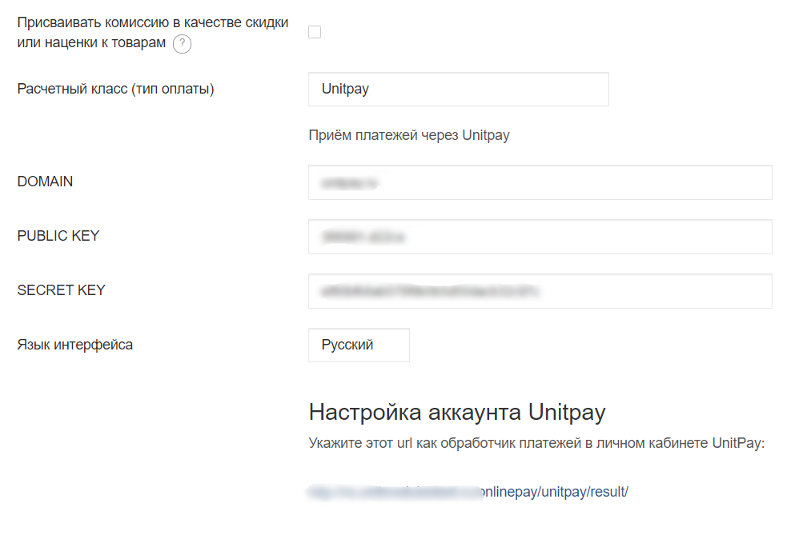

# ReadyScript

### Инструкция по настройке и установке модуля.

1. Скачайте  [архив](https://github.com/unitpay/readyscript-module/archive/master.zip) с модулем.

2. Распакуйте содержимое архива в корень сайта.

3. Перейдите в админпанель сайта.

4. Перейдите в меню "Веб-сайт"-&gt; "Настройка модулей".

5. Нажмите на кнопку "Очистить кэш".

6. Установите модуль "Unitpay" для этого нажмите на кнопку "Не установлен" напротив модуля.

7. Перейдите в "Магазин"-&gt; "Способы оплаты".

8. Нажмите "Добавить способ оплаты" и настройте новую платежную систему. Не забудьте указать DOMAIN \(unitpay.money\), а также PUBLIC KEY и SECRET KEY, которые вы можете взять в личном кабинете unitpay.money.

9. В личном кабинете unitpay.ru введите адрес обработчика платежей    
[http://](http://%20/)[&lt;адрес](http://xn--%3C-8cdug0fj/) вашего сайта&gt;[/onlinepay/unitpay/result/](http://ttestt.ru/onlinepay/unitpay/result/)

p.s. В обработчике платежей высветится сообщение "Ошибка формата", не обращайте на это внимания.

