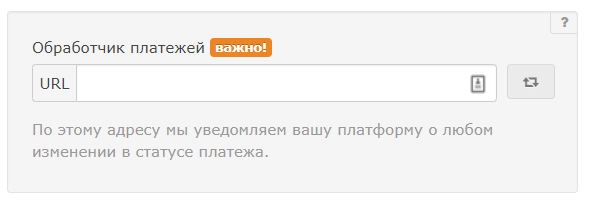

# Taplink

### Инструкция по настройке приема платежей через сервис Taplink.

Для подключения приема оплат через Taplink необходимо иметь доступ с планом «[бизнес-тариф](https://taplink.ru/tariffs/)»:

1. Перейдите в Taplink в «Настройки» во вкладку «Платежи». Нажмите «Добавить платежную систему». 
2. Выберите тип юр. лица, с которым вы зарегистрировались в Unitpay. 
3. Скопируйте URL «Обработчик платежей» и вставьте его в поле «Обработчик платежей» 

   в личном кабинете Unitpay.   
       

4. Укажите id проекта в Unitpay. Скопировать его можно тут:      
5. Добавьте секретный ключ. Скопировать его можно в личном кабинете Unitpay:  

    

6. Укажите доступные вам методы оплаты. 
7. После проверки оплаты переведите чекбокс из «Тестовый режим» в «Рабочий».


Подробные инструкции по подключению оплат описаны в [данном разделе Taplink](https://taplink.ru/guide/payments-configuration.html). При возникновении вопросов вы можете обратиться в нашу поддержку или в поддержку taplink.


