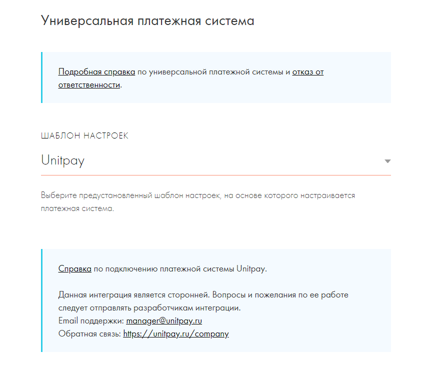
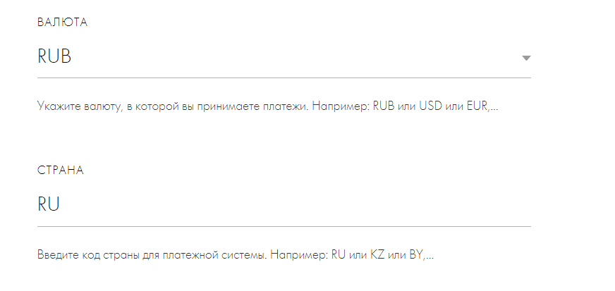
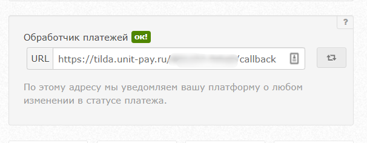

# Tilda

### Инструкция по настройке и установке модуля.

1\) В личном кабинете Tilda перейдите в _Настройки -&gt; Платежные системы -&gt; Универсальная платежная система._ Выберите шаблон "**Unitpay**"

2\) Задайте ПУБЛИЧНЫЙ КЛЮЧ _\(PUBLIC KEY\)_ и СЕКРЕТНЫЙ КЛЮЧ _\(SECRET KEY\)_ из настроек вашего проекта в UNITPAY

3\) Установите валюту и язык платежной формы. 

4\) Проверьте корректность дополнительных параметров в настройках модуля:  
- "_ФФД: ПРИЗНАК СПОСОБА РАСЧЁТА"_ - должно стоять "**Выключено**".

5\) В ставке НДС выберите "_Не передавать данные для чека_"

6\) В настройках проекта Unitpay установите обработчик в формате:   
https://tilda.unit-pay.ru/_**PUBLIK KEY из настроек Unitpay**_/callback


Далее обратитесь **в** [**службу поддержки Unitpay**](https://help.unitpay.money/support) для окончательной настройки и включения модуля. 


7\) Модуль поддерживает работу с двумя типами корзин в Tilda:

* Блок **ST100** "Корзина с формой заказа" 
* Блок **ST105 "**Платежная система. Прямая оплата без корзины"

