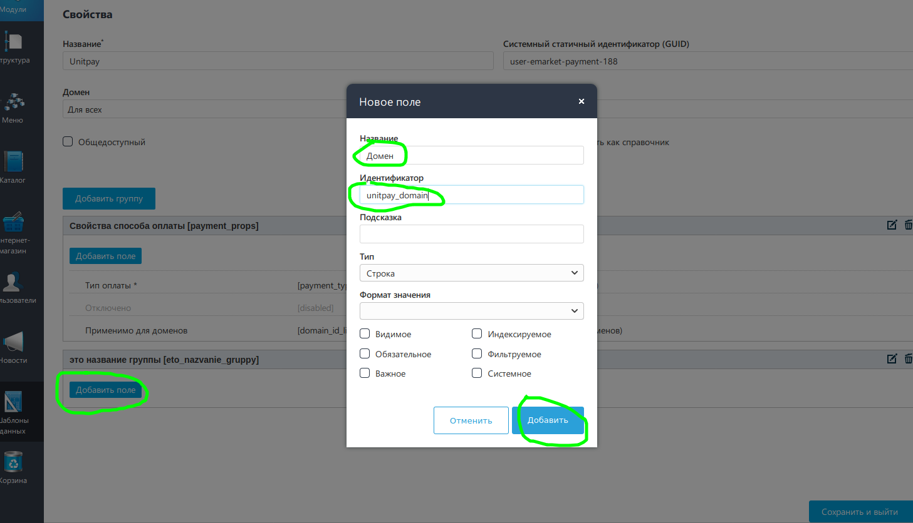
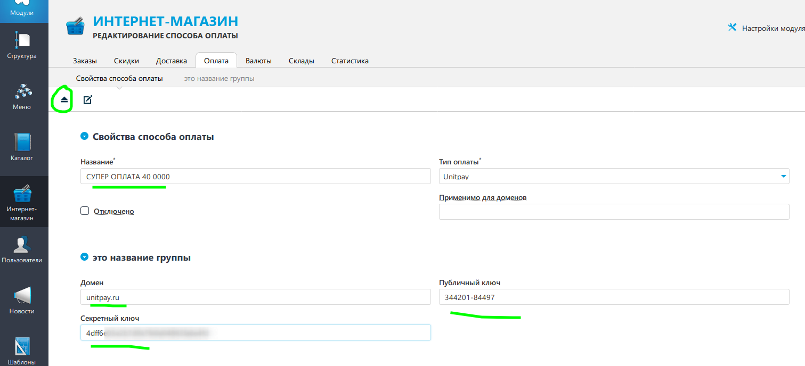

# UMI.CMS

**The Module Setup and Installation Instruction**

We advise to backup the database and the site before making the following operations.

1. Download the [archive](https://github.com/unitpay/umi-module/archive/v2.0.1.zip) with the module. 
2. Copy the contents of the unitpay directory from the archive to the root of your site.  Note that the standard folder for the module will be templates/demodizzy/php/emarket/payment/, if you have another store template, copy it to the appropriate directory. For example, templates/demomarket/php/emarket/payment/ 
3. Open [http://&lt;your\_site\_address&gt;/unitpay.php&gt;/unitpay.php](http://<your_site_address>/unitpay.php>/unitpay.php) in your browser. You should see the word "Ready".  It is likely that nothing will work because of the access settings. You can temporarily bypass them, for example, by changing the file name .htaccess on .htaccess\_old, follow the link [http://&lt;your\_site\_address&gt;/unitpay.php&gt;/unitpay.php](http://<your_site_address>/unitpay.php>/unitpay.php), and then change the file name back. The specific method depends on your control panel.  
4. If everything is Ok with item 3, delete &lt;your site root&gt;/unitpay.php file. 
5. Go to the admin panel of your site and move to Data templates, then select Unitpay in the payment methods and click Edit.  

  

6. Click Add group in the opened window and create two fields there:

7. with "Domain" name and "unitpay\_domain"

8. with "Public key" name and "public\_key"

9. with "Secret key" name and "secret\_key"

10. Then click Save and Log out.

11. Go to the Online store menu in the Payment tab.

12. Select Unitpay in the Add method drop-down list.

13. In the opened window, enter the name of the payment method, the domain \(unitpay.money\), as well as the public and secret keys which you can find in your Unitpay.money account. Then click the Add button to save your changes.

14. In your unitpay.money account, enter  [http://&lt;your\_site\_name&gt;/&gt;/emarket/gateway](http://<your_site_name>/>/emarket/gateway) in the payment handler field. Do not be afraid of Format Error message. Due to the implementation features, it is normal in this case.

