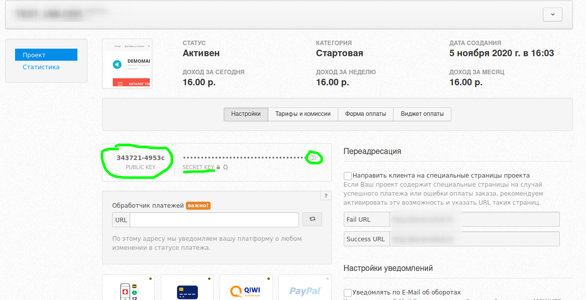

# UMI.CMS

### Инструкция по настройке и установке модуля.

Перед следующими манипуляциями советуем сделать бекап базы данных и сайта.

1. Скачайте [архив](https://github.com/unitpay/umi-module/archive/v2.0.1.zip) с модулем.

2. Скопируйте содержимое директории unitpay из архива в корень вашего сайта. 

Обратите внимание что, стандартной папкой для модуля будет templates/**demodizzy**/php/emarket/payment/, если у вас другой шаблон магазина, то копируйте в соответствующую директорию. Например, templates/**demomarket**/php/emarket/payment/

3. Зайдите в браузере по адресу [http://&lt;адрес\_вашего\_сайта&gt;/unitpay.php](http://xn--%3C__-6vebbaqmind7d3d1athw2j/)&gt;/unitpay.php. Вы должны увидеть слово "Готово".  
  
Велика вероятность что, ничего не получится из-за настроек доступа. Временно обойти их можно, например, поменяв имя файла .htaccess на .htaccess\_old , перейти по ссылке [http://&lt;адрес\_вашего\_сайта&gt;](about:blank)/unitpay.php , а потом поменять имя файла обратно. Конкретный способ зависит от вашей панели управления.

4. Если в п.3 прошло все как надо, удалите файл &lt;корень\_вашего\_сайта&gt;/unitpay.php.

5. Зайдите в админку вашего сайта и перейдите в "Шаблоны данных", далее выберите в способах оплаты Unitpay и нажмите кнопку "Редактировать".

6. В открывшемся окне нажмите "Добавить группу" 

и в ней создайте три поля:

- с названием "Домен" и идентификатором "unitpay\_domain",

- с названием "Публичный ключ" и идентификатором "public\_key",

- с названием "Секретный ключ" и идентификатором "secret\_key",

7. Далее нажмите "Сохранить и выйти".

8. Перейдите в меню "Интернет-магазин" во вкладку "Оплата".

9. В выпадающем списке "Добавить способ" выберите "Unitpay".

10. В открывшемся окне введите название способа оплаты, домен \(unitpay.money\), а также публичный и секретный ключи, которые вы можете взять в личном кабинете Unitpay.money. После чего нажмите на кнопку "Добавить" для сохранения изменений.

11. В личном кабинете unitpay.money в поле обработчик платежа введите [http://&lt;имя\_вашего\_сайта&gt;/](http://xn--%3C__-7vebaolv6au8a9a1ct4h3f/)&gt;/emarket/gateway. Не пугайтесь появления надписи "Ошибка формата!" Из-за особенностей реализации в данном случае это нормально.

