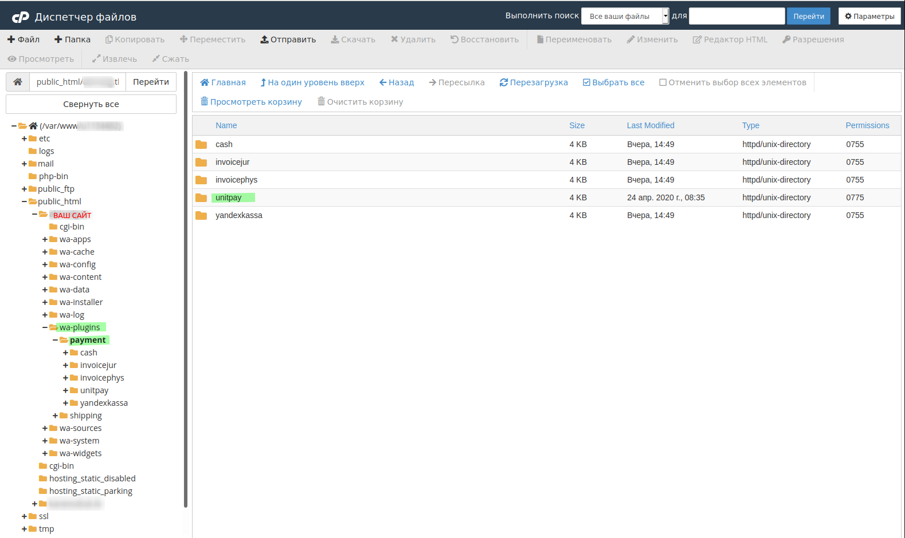
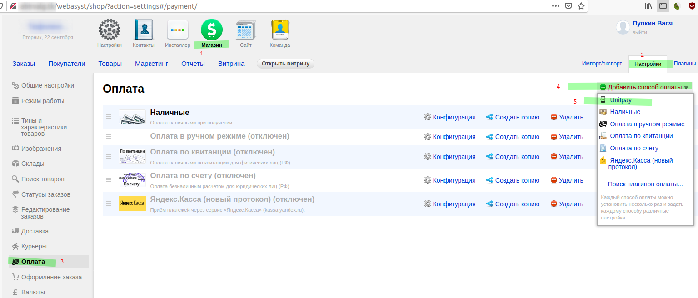
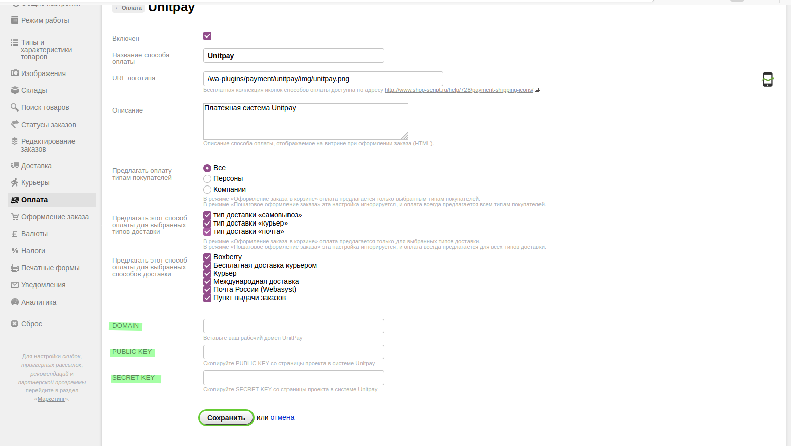
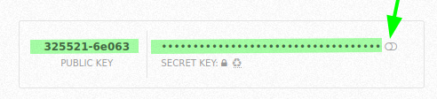
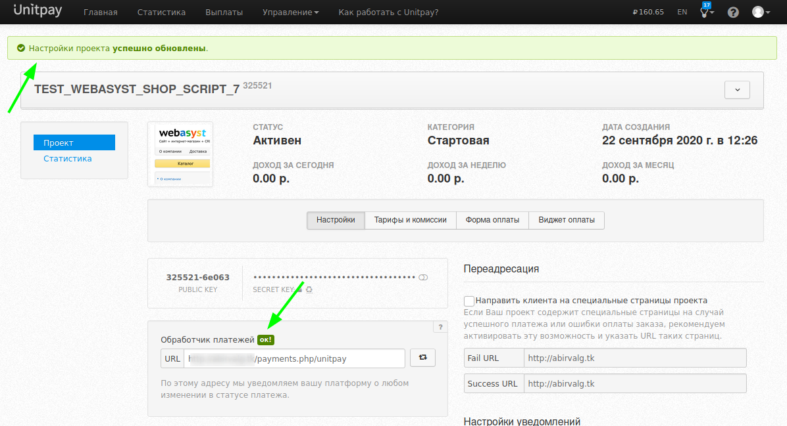
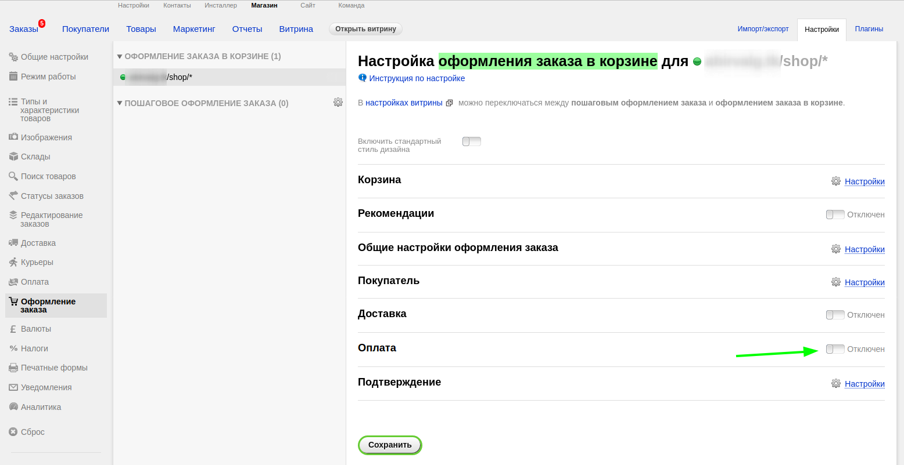

# Webasyst Shop Script 7 \(8\)

**The Module Setup and Installation Instruction**

1. Download the [archive](https://github.com/unitpay/shopscript-module/releases/tag/v2.1.0) with the module \(.zip\).

2. Copy the **unitpay** folder to **wa-plugins/payment** _\(there is also wa-plugins/payment inside wa-sources - this is not the directory that you need, do not confuse it\)._

3. Go to the store's control panel "**Settings → Payment → Add payment method → Unitpay**"

4. The DOMAIN \(unitpay.money\), PUBLIC KEY, and SECRET KEY fields can be taken from your project page on unitpay. Make sure that the module is checked "**Enabled**".

5. On the project page in your unitpay dashboard, enter the payment processor using the template:[   
http://адрес\_вашего\_сайта/payments.php/unitpay](http://xn--__-6kcbbakjfkd5c8cvaqht4h/payments.php/unitpay) and press enter. 

If you are not mistaken, the payment handler will say **OK!**

6. ADDITION: to be able to pay for goods in the store, you need to enable this step. "**Shop → Settings → checkout → enable the Payment step**".

