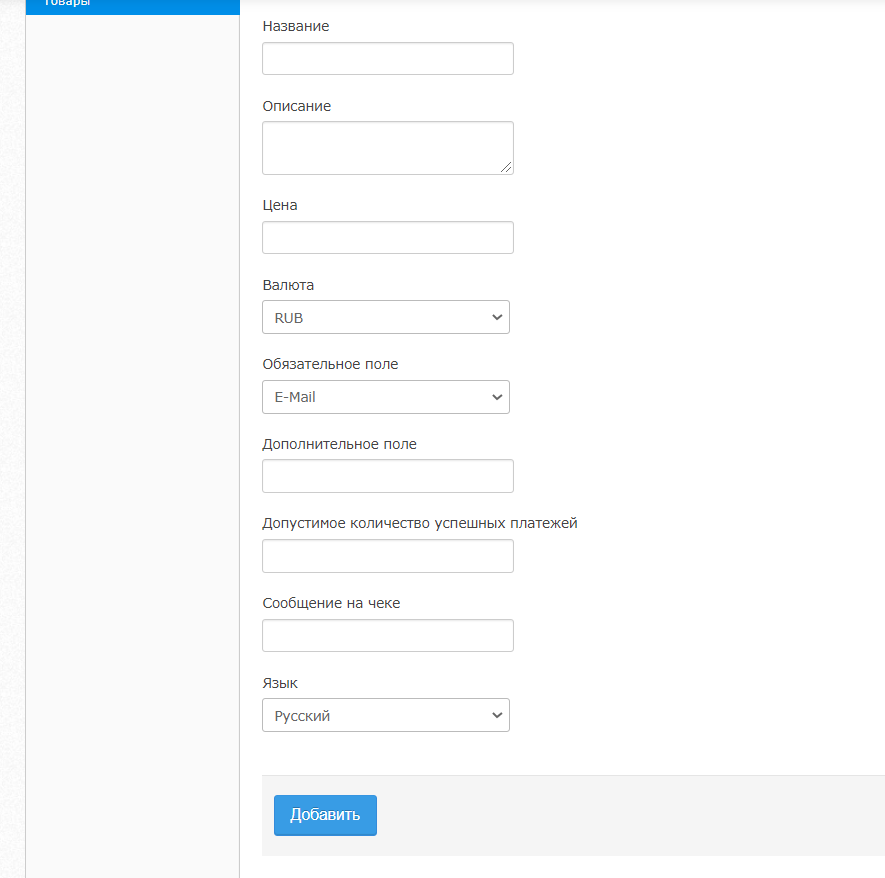

# Создание ссылок на оплату в личном кабинете

#### Как создать ссылку на оплату в личном кабинете?

В феврале 2020 года у Unitpay появилось новое решение: **создание ссылок на оплату в личном кабинете**. Интеграция платежного решения на сайт и работа с **API** в этом случае **не требуется**.

Чтобы получить ссылку на оплату, необходимо в настройках активного проекта выбрать **раздел “Товары”**. Использование функции возможно только после согласования. Для этого обратитесь в нашу службу поддержку.

Чтобы добавить новый товар, необходимо нажать **\[+ Добавить товар\]** и заполнить следующие поля: 

**Название** - название товара, которое плательщик увидит перед оплатой.

**Описание** - описание товара, которое плательщик увидит перед оплатой.

**Цена** - сумма, на которую будет выставлен счет плательщику.

**Валюта** - валюта заказа по стандарту ISO 4217 \(RUB, UAH, BYN, EUR, USD итд. [Полный список валют](https://help.unitpay.money/book-of-reference/bukvennye-kody-valyut)\).

**Сообщение на чеке** - информация, которую увидит пользователь, после успешной оплаты.

**Язык** - язык формы \(русский/английский\).

**Обязательное поле** - вопрос, на который плательщик должен обязательно ответить перед оплатой. Ответ будет использован в разделе Статистика - по нему легко найти платежи конкретных пользователей. Доступен выбор одного из обязательных полей: E-mail и Телефон. 

**Дополнительное поле** - текст дополнительного вопроса, на который сможет ответить клиент перед оплатой. Ответ отобразиться в разделе Статистика рядом с обязательным полем.

**Допустимое количество успешных платежей** - партнер может устанавливать ограничение на количество успешных платежей за один товар. Если поле останется пустым, ограничение не будет установлено.

Таким образом товар будет создан и доступен для продажи:

#### Что делать с созданным Товаром?

В меню товара можно:

1. **Поделиться ссылкой на товар**: 

* скопировать ссылку на оплату;
* скачать QR-код для оплаты как изображение.

Обратите внимание: ссылки создаются в домене **up.sale**.

2. **Редактировать товар.**

После создания товара допустимо редактировать **Цену**, **Обязательное поле**, **Дополнительное поле**и **Допустимое количество успешных платежей**. Редактирование **Названия** и **Описания товара**недоступно - все товары и их описания проходят модерацию службы безопасности после добавления. 

3. **Деактивировать** активный **товар**.

При переходе по ссылке на деактивированный товар плательщик увидит ошибку “ _Ошибка 404. Страница не найдена_”. 

4. **Активировать** неактивный **товар**.

#### Как проходит оплата?

Перейдя по ссылке, плательщик сначала видит дополнительное окно с **названием** товара, **описанием** товара, **суммой** платежа и выбранными вами **полями** для заполнения:

Введя данные и кликнув на “Перейти к оплате”, плательщик попадает на стандартную форму оплаты.

В разделе “ _Детализация платежей_” в столбце “_№ Счета_” вы видите информацию, указанную плательщиком. 

