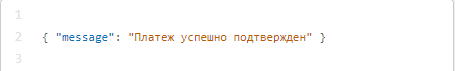

# Payments with Pre-authorization

We recommend using this function after consulting with your supervising manager.

You can initiate the creation of a payment with pre-authorization by using the additional **preauth** parameter when [creating the payment](create-payment.md).

|  | **Value** | **Description** |
| :--- | :--- | :--- |
| **preauth** | true/false | Use this flag to create a payment with pre-authorization. By default, this flag is disabled and the value is 0 |
| **preauthExpireLogic** | number | Field for the logic of blocking payment with pre-authorization    0 - If there is no request for confirmation or cancellation, payment will be confirmed upon expiration of the lock on the side of the acquirer bank \(~114 hours after creating the payment\)  1 - If there is no request for confirmation or cancellation, payment will be cancelled upon expiration of the lock on the side of the acquirer bank \(~114 hours after creating the payment\). If the parameter is not used, the payment will be cancelled after the expiration date. |

**Confirming a payment with pre-authorization**

To confirm the payment with pre-authorization \(debit the funds blocked on the payer's card\), you need to run a GET query:

|  | **Value** | **Description** |
| :--- | :--- | :--- |
| paymentId | number | Payment ID in the UnitPay system. |
| secretKey | line | Project secret key. |

**Successful response when confirming payment with pre-authorization**

| Платеж успешно подтвержден | Payment successfully confirmed |
| :--- | :--- |

**Error response when confirming payment with pre-authorization**

| Платеж не может быть подтвержден | The payment cannot be confirmed |
| :--- | :--- |

|  | **Value** | **Description** |
| :--- | :--- | :--- |
| message | line | Information with a description of the request error. |

**Canceling a payment with pre-authorization**

To cancel the payment with pre-authorization \(unblock the funds on the payer's card\), you need to run a GET query:

|  | **Value** | **Description** |
| :--- | :--- | :--- |
| paymentId | number | Payment ID in the UnitPay system. |
| secretKey | line | Project secret key. |

**Successful response when cancelling payment with pre-authorization**

| Блокировка успешно отменёна | The block successfully canceled |
| :--- | :--- |

**Error response when cancelling payment with pre-authorization**

| Платеж не может быть отменен | The payment cannot be cancelled |
| :--- | :--- |

|  | **Value** | **Description** |
| :--- | :--- | :--- |
| message | line | Information with a description of the request error. |


Payments with Pre-authorization don't work simultaneously with [subscriptions](https://help.unitpay.money/v/en/payments/recurring-payments/create-subscription)


