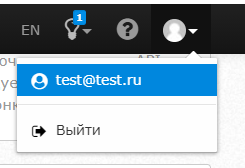
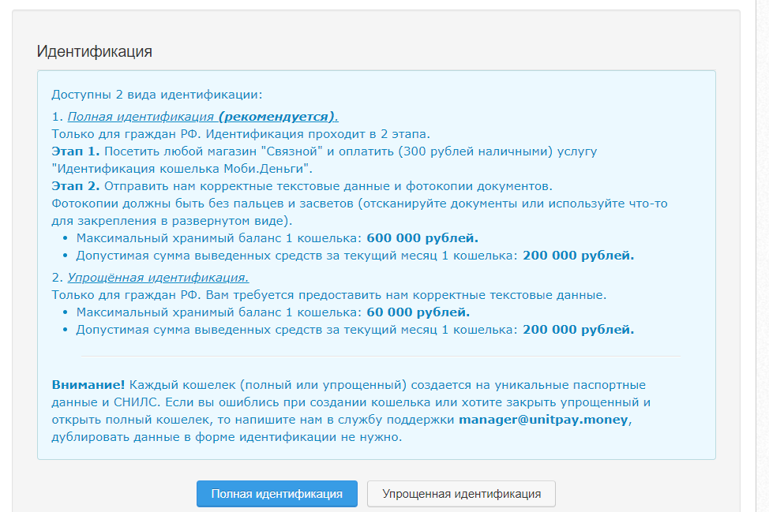
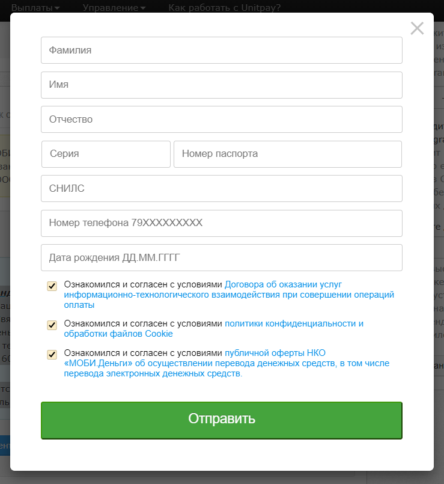
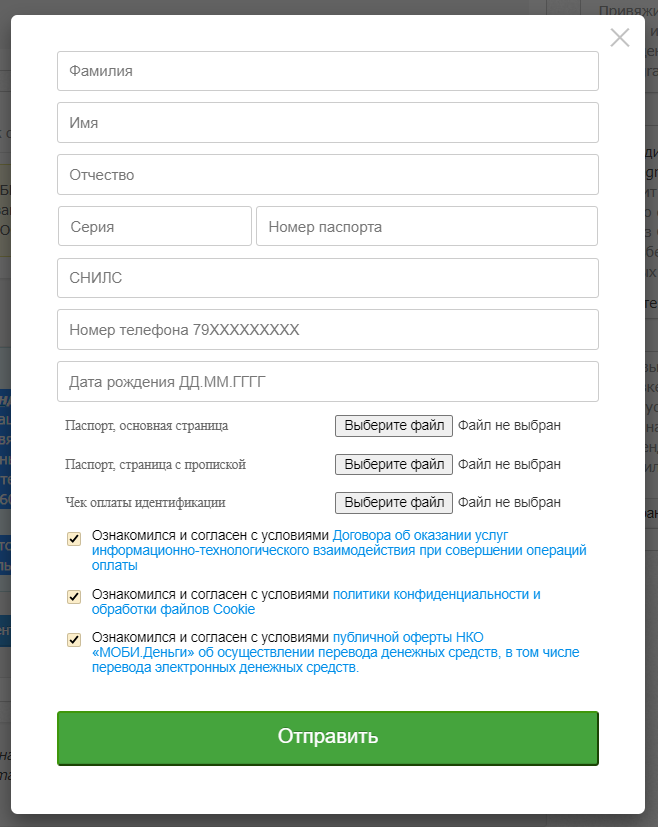

# Добавление кошелька UnitWallet


**Внимание!** Каждый кошелек \(полный или упрощенный\) создается на уникальные паспортные данные и СНИЛС \(**1 человек = 1 кошелёк**\). Регистрация кошельков возможна только для **совершеннолетних граждан РФ.**

Если вы ошиблись при создании кошелька или хотите закрыть упрощенный и открыть полный кошелек, то напишите нам в службу поддержки **manager@unitpay.money,** дублировать данные в форме идентификации не нужно.


**Для добавления кошелька UnitWallet вам необходимо** \(предварительно рекомендуем вам [ознакомиться с FAQ](https://help.unitpay.money/unitpay-management/dobavlenie-koshelka-unitwallet#faq)\):

1\) Перейти в личном кабинете в настройки аккаунта 

2\) Прокрутить вниз до формы добавления кошельков


Доступны 2 вида идентификации:

1. Полная идентификация **\(рекомендуется\)**.  
Только для граждан РФ. Идентификация проходит в 2 этапа.  
**Этап 1.** Посетить любой магазин "Связной" и оплатить \(300 рублей наличными\) услугу "Идентификация кошелька Моби.Деньги".  
**Этап 2.** Отправить нам корректные текстовые данные и фотокопии документов.  
-  Максимальный хранимый баланс 1 кошелька: **600 000 рублей.  
-**  Допустимая сумма выведенных средств за текущий месяц 1 кошелька: **200 000 рублей.**

2. Упрощённая идентификация.  
Только для граждан РФ. Вам требуется предоставить нам корректные текстовые данные.  
-  Максимальный хранимый баланс 1 кошелька: **60 000 рублей.  
-**  Допустимая сумма выведенных средств за текущий месяц 1 кошелька: **200 000 рублей.**


3\) Упрощенная идентификация

4\) Полная идентификация

5\) После заполнения полей и загрузки сканов документов \(при полной идентификации\) наша служба поддержки проведет модерацию и направит данные на создание кошельков. 

6\) После успешного создания кошельков вы получите уведомление от нашей службы поддержки.

## FAQ

В: Что будет после 9 февраля, если я не сделаю это или не смогу обеспечить нужный объем кошельков?  
О: Мы сможем обеспечить для вас прием и вывод средств только по 2 направлениям: гривневые карты Украины и WMZ. Остальной входящий и исходящий трафик будет лимитирован в зависимости от количества привязанных вами кошельков.   
  
В: Есть ли разница, каким способом зарегистрировать кошелек?   
О: Да. На каждом зарегистрированном через “Связной” кошельке, вы можете хранить до 600 тыс. рублей. На кошельках, зарегистрированных через виджет – не более 60 тыс. рублей. Прием и выплату средств на сумму от 50 \(15\) тыс. рублей также возможно производить только через кошельки, зарегистрированные через “Связной”. Поэтому советуем завести хотя бы несколько кошельков именно через “Связной”.  
  
В: На кого я могу регистрировать кошельки?  
О: Регистрация доступна только для граждан РФ. Всех, на кого вы зарегистрируете такие кошельки, мы считаем выгодоприобретателями вашего бизнеса.

В: А как я буду управлять потоками через эти кошельки?  
О: Мы берём эту функцию на себя. Вам не нужно будет тратить на это время.

В: Лица, на которые будут зарегистрированы кошельки, должны иметь отношение к нашему бизнесу?  
О: Для нас владельцы всех кошельков, которые привязаны к аккаунту, будут считаться выгодоприобретателями вашего бизнеса.

В: Как проверяются данные для заведения кошельков?  
О: Соответствие данных действительности проверяется по различным базам на стороне НКО. Отказ в приеме данных может быть получен нами только через несколько дней после прогрузки.  
  
В: Что делать, если у меня изменится объем выплат? Как вы рассчитывали необходимое количество кошельков?  
О: Необходимо своевременно увеличивать количество кошельков, исходя из планируемого годового оборота ваших проектов. Расчет ведется исходя из того, что через 1 кошелек допустимо выводить до 200 тыс. рублей / месяц, или до 2,4 млн. рублей / год.

В: В каком случае кошельки могут быть заблокированы и что будет с деньгами, хранящимися на них?   
О: Кошельки блокируются, если паспорт по результатам автоматической проверки на стороне НКО будет признан недействительным \(истек срок действия, гражданин сменил фамилию и т.д.\).  
  
В: Чем отличаются кошельки с упрощенной идентификацией \(через виджет\) от кошельков с полной идентификацией \(через салоны связи “Связной”\)?  
О: Если вы регистрируете кошелек через виджет, вы регистрируете упрощённый кошелек. Допустимая сумма выведенных средств за текущий месяц - 200 тыс. руб. / месяц, максимальный баланс - 60 тыс. рублей. Когда все кошельки “забиты” средствами, вы не сможете принять большой платеж, нужно выводить оттуда средства. Сумма одной транзакции на вывод с таких кошельков также ограничена: 15 тыс. рублей. Поэтому рекомендуем, по возможности, заводить кошельки с полной идентификацией. Как минимум, какой-то процент кошельков с полной идентификацией \(через "Связной"\) следует завести. Допустимая сумма вывода через них такая же - 200 тыс. руб. / месяц, но максимальный баланс там - до 600 тыс. рублей. Можно принимать \(до 500 тыс. рублей\) и выводить большие суммы \(до 100 тыс. рублей\).  
  
В: А как быть тем, кто из Украины?   
О: Понимаем, что это довольно непростая задача для вас, но вам необходимо зарегистрировать кошелёк на выгодоприобретателя - гражданина РФ.  
  
В: Мы зарегистрировались на упрощенный кошелек, но потом хотим сделать полный через Связной. Там можно сделать?   
О: Сделать это можно. В этом случае вам нужно будет закрыть упрощённый кошелёк и открыть полный. На один паспорт может быть заведен только один кошелек \(упрощенный или полный\).

В: Если я зарегистрирую кошелёк на доверенное лицо, оно сможет получить доступ к моему аккаунту или средствам?   
О: Нет, не сможет.

В: И если у меня 2 аккаунта unitpay, можно ли будет это лицо зарегистрировать на оба аккаунта?   
О: Нет, 1 аккаунт - 1 кошелёк.

В: Если нет Связного, можно ли зарегистрировать полный другим способом?   
О: Регистрация кошельков с полной идентификацией доступна только через магазины "Связной". Регистрация упрощённых кошельков доступна без личного визита и производится онлайн.

В: Для самозанятых тоже нужны кошельки?   
О: Да

В: Если у меня нет возможности создать кошелек, смогу ли потом вывести средства, которые получил ранее?  
О: Вам необходимо добавить кошельки, иначе вы не сможете выводить. Можете обратиться в нашу службу поддержки, мы подскажем как лучше поступить.  
  
В: Как узнать, что кошелек прошел проверку?  
О: Как только данные будут проверены и кошелек создан, вам обязательно придет оповещение на регистрационную почту. Как правило, это занимает около 3 дней, но, в связи с массовым переходом на новую схему работы, могут быть задержки. В любом случае, беспокоиться вам не нужно - если вы отправили на проверку кошелек до 9.02, то мы не остановим вашу работу 10.02, т.к. с вашей стороны всё было вовремя. Даже если кошелек не пройдет проверку, прием платежей мы вам не отключим, дадим возможность зарегистрировать на другие данные.

