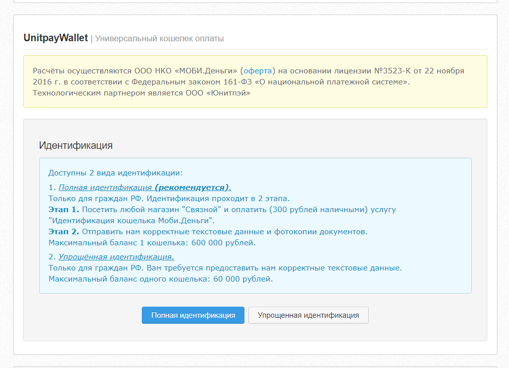

# Добавление кошелька UnitWallet

**Для добавления кошелька UnitWallet вам необходимо:**

1\) Перейти в личном кабинете в настройки аккаунта 

2\) Прокрутить вниз до формы добавления кошельков


Доступны 2 вида идентификации:

1. Полная идентификация **\(рекомендуется\)**.  
Только для граждан РФ. Идентификация проходит в 2 этапа.  
**Этап 1.** Посетить любой магазин "Связной" и оплатить \(300 рублей наличными\) услугу "Идентификация кошелька Моби.Деньги".  
**Этап 2.** Отправить нам корректные текстовые данные и фотокопии документов.  
Максимальный баланс 1 кошелька: 600 000 рублей.

2. Упрощённая идентификация.  
Только для граждан РФ. Вам требуется предоставить нам корректные текстовые данные.  
Максимальный баланс одного кошелька: 60 000 рублей.


3\) Упрощенная идентификация

4\) Полная идентификация

5\) После заполнения полей и загрузки сканов документов \(при полной идентификации\) наша служба поддержки проведет модерацию и направит данные на создание кошельков. 

6\) После успешного создания кошельков вы получите уведомление от нашей службы поддержки.

