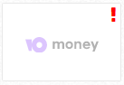
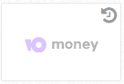
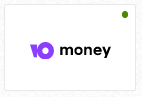

# Подключение ЮMoney \(бывшие "Яндекс.Деньги"\)

1. Для того, чтобы подключить прием ЮMoney, проект должен иметь окончательную категорию \(кроме “Другое“\), а также должен быть заключен агентский договор. 
2. Далее, в способах оплаты можно увидеть значок ЮMoney с восклицательным знаком:

Нужно нужно нажать на кнопку, чтобы проект отправился на модерацию в службу безопасности ЮMoney. После нажатия, восклицательный знак сменится на круглую стрелочку: это означает, что проект находится на модерации.


Срок модерации проекта в ЮMoney - до 14 рабочих дней. Если прошло больше времени, обратитесь в службу поддержки или персональному менеджеру.


3. После этого возможны 3 варианта развития событий:

* проект успешно прошел модерацию, способ оплаты ЮMoney подключен:

* проект не прошел модерацию, способ оплаты ЮMoney исчезнет из доступных.

